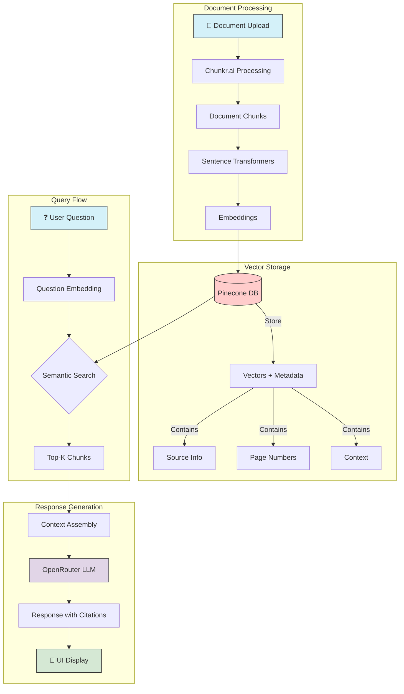

# Chunkr3 - Document Chat with Citations

A modern document chat application that allows users to have conversations with their documents while maintaining source citations. Built with FastAPI and Next.js.


## 🌐 Live Demo

Experience Chunkr3 in action:
- **Production Site**: [https://chunkr3.vercel.app/](https://chunkr3.vercel.app/)

### Deployment Information
- Frontend hosted on [Vercel](https://vercel.com)
- Automatic deployments from main branch

### Quick Start with Live Demo
1. Visit [https://chunkr3.vercel.app/](https://chunkr3.vercel.app/)
2. Upload your document
3. Start chatting with your content
4. Experience real-time citations and responses


## 🚀 Prerequisites

### Backend Requirements
- Python 3.8+
- pip (Python package manager)
- Virtual environment (recommended)

### Frontend Requirements
- Node.js 20.x+
- npm or yarn

## 🛠️ Setup & Installation

### Clone the Repository
```bash
git clone https://github.com/yourusername/Chunkr3.git
cd Chunkr3
```

### Backend Setup
```bash
cd backend
python -m venv venv
source venv/bin/activate  # On Windows: .\venv\Scripts\activate
pip install -r requirements.txt
```

Create a `.env` file in the backend directory:
```env
# Chunkr Configuration
CHUNKR_API_KEY="ch_R8gs1HovNaj_CXWDa4iYsVrAi4ZYKia7PcbuFSZqH4HfU"
CHUNKR_API_URL="https://api.chunkr.ai/v1/chunk"

# OpenRouter Configuration
OPENROUTER_API_KEY=
OPENROUTER_BASE_URL="https://openrouter.ai/api/v1"


# Pinecone Configuration
PINECONE_API_KEY="pcsk_7Vc8WU_BiovfBznthALfNHB8M3MrfuBe31pEjSjK5apSt58EpMCDWNS7U6NXeuJG8qfv6i"
PINECONE_ENV="us-west1-gcp"  # or your Pinecone environment
PINECONE_INDEX_NAME="chunkr3"

# Backend Configuration
BACKEND_CORS_ORIGINS=["http://localhost:3000"]
```

Create a `.env` file in the backend directory:
```env
NEXT_PUBLIC_BACKEND_URL=http://localhost:8000
```
The above URL should be changed upon deployment to the address of the backend server. 
### Frontend Setup
```bash
cd frontend
npm install
```

### Chunkr Account Setup
1. Visit [Chunkr.ai](https://chunkr.ai) to sign up
2. Navigate to the billing section
3. Apply the provided coupon code for the Starter Plan
4. Add your credit card information
5. Copy your API key from the dashboard

## 🎮 Running the Application

### Start the Backend Server
```bash
cd backend
source venv/bin/activate  # On Windows: .\venv\Scripts\activate
uvicorn api.main:app --reload
```
The backend will be available at `http://localhost:8000`

### Start the Frontend Development Server
```bash
cd frontend
npm run dev
```
The frontend will be available at `http://localhost:3000`

## 📚 Using the Application

1. **Document Ingestion**
   - Navigate to the upload page
   - Drag and drop your document or click to select
   - Supported formats: PDF, TXT, DOCX
   - Wait for the ingestion process to complete

2. **Chat Interface**
   - Select your ingested document
   - Type your questions in the chat input
   - Receive responses with highlighted citations
   - Click on citations to view source context

3. **View Citations**
   - Citations are automatically included in responses
   - Click on any citation to jump to the referenced section
   - Citations include page numbers and context

## 🏗️ System Flow



### Tech Stack
- **Backend**
  - FastAPI (Python web framework)
  - Chunkr.ai (Document processing)
  - OpenRouter (LLM API)
  - Sentence Transformers
  - Pinecone (Vector storage)

- **Frontend**
  - Next.js 15
  - React 19
  - TailwindCSS
  - Radix UI Components
  - Zustand (State management)


## 🐳 Docker Support

Both frontend and backend include Dockerfile configurations for containerized deployment.

### Build and Run with Docker
```bash
# Backend
cd backend
docker build -t chunkr3-backend .
docker run -p 8000:8000 chunkr3-backend

# Frontend
cd frontend
docker build -t chunkr3-frontend .
docker run -p 3000:3000 chunkr3-frontend
```
or you can run the yaml file all together

```bash
docker-compose up --build
# Run this in the root directory /Chunkr3/
```
